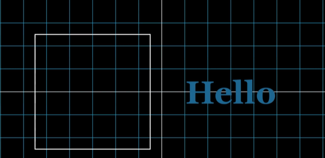

## What are MObjects?
Mobjects stands for Mathematical Objects. They are the fundamental building blocks of any Manim animation—essentially everything you see on the screen, from a simple dot to a complex graph.
In Manim, basic Mobjects are categorized into several major groups:

- Geometry: ```Circle()```,```Square()```,```Rectangle()```,```Line()```,```Triangle```
- Text & Math: ```Text()``` (Standard Text), ```MathTex()``` (Latex-formatted equations)
- Coordinate System: ```Axes()```,```NumberPlane()```
- [MObject Gallery](https://kolibril13.github.io/mobject-gallery/)

## Styling

When you create a Mobject, it usually appears with default settings (e.g., a thin white outline). You can transform its appearance using Styling methods.

Changing Color and Surfaces
- ```.set_color()```: Changes the color of the object (e.g., RED, BLUE, or Hex codes like "#22ff00").
- 


## Creating a Rectangle


```py
class CreateRectangle(Scene):
    def construct(self):
        a = Text("Hello", color = DARK_BLUE, weight = BOLD, font_size=100)
        self.play(Write(a))
        self.wait(1)

        s = Square(side_length = 5)
        self.play(Write(s))
```

---
## Shifting Objects on the screen


```py
class CreateRectangle(Scene):
    def construct(self):
        self.add(NumberPlane())
        a = Text("Hello", color = DARK_BLUE, weight = BOLD, font_size=100).shift(RIGHT * 3)
        self.play(Write(a))
        self.wait(1)

        s = Square(side_length = 5).shift(LEFT * 3)
        self.play(Write(s))
```
---

## Changing parameters of an object
```py
class CreateRoundRectangle(Scene):
    def construct(self):
        s = RoundedRectangle(fill_opacity = 0.2, color = RED, corner_radius = 0.1)
        self.play(Write(s))
        self.wait(1)
```
---

## Different ways to animate something on the screen
```py
class CreateRoundRectangle(Scene):
    def construct(self):
        s = RoundedRectangle(fill_opacity = 0.2, color = RED, corner_radius = 1)
        self.play(DrawBorderThenFill(s))
        self.wait(1)
```