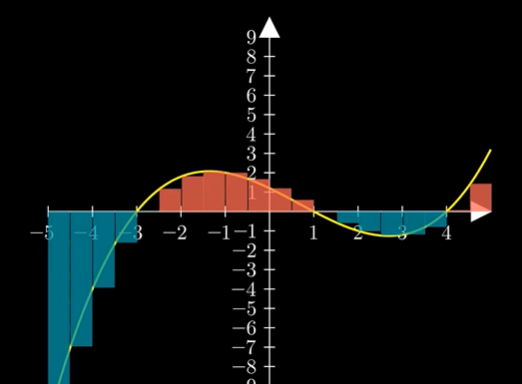

# Calculus Area 2

```py
class Test(Scene):
    def construct(self):
        axes = Axes(
            x_range=[-5, 5],x_length=8, y_range=[-10, 10], y_length=7
        ).add_coordinates()
        
        graph = axes.plot(lambda x: 0.1 * (x-4)*(x-1)*(x+3))
        graph.set_color(YELLOW)
        self.add(axes, graph)
        
        dx_list = [1,0.5,0.3,0.1,0.05,0.025,0.01]
        rectangles = VGroup(
            *[
                axes.get_riemann_rectangles(
                    graph,
                    x_range=[-5, 5],
                    dx=dx,
                    stroke_width=0.1,
                    stroke_color=WHITE,
                    fill_opacity=0.75,
                    color=RED
                )  
                for dx in dx_list             
            ]
        )
        
        first_area = rectangles[0]
        for k in range(1,len(dx_list)):
            new_area = rectangles[k]
            self.play(Transform(first_area, new_area), run_time=3)
            self.wait(0.5)
            
        self.wait()
```