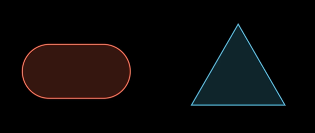
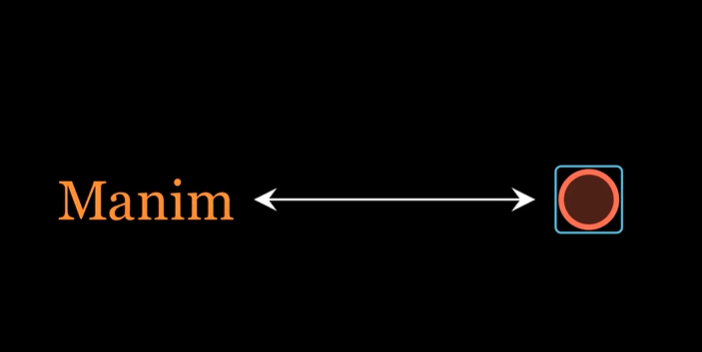

# Animation Chapter
## Animation 1

```py
class Animation1(Scene):
    def construct(self):
        s = RoundedRectangle(fill_opacity = 0.2, color = RED, corner_radius = 1).shift(LEFT * 3)
        t = Triangle(fill_opacity = 0.2, color = BLUE).scale(2).shift(RIGHT * 3)
        self.wait(1)
        self.play(Write(s), Create(t))
        self.wait(2)
```
---
## Animation 2

### Create a circle
```py
class Animation2(Scene):
    def construct(self):
        s = Circle(radius = 0.5, stroke_width = 10).set_color("#FF00FF")
```

### Surrounding Rectangle
```py
class Animation2(Scene):
    def construct(self):
        s = Circle(radius = 0.5, stroke_width = 10, color = RED, fill_opacity = 0.3)
        r = SurroundingRectangle(s, color = BLUE, corner_radius = 0.1)
        self.play(Write(s), Write(r))
        self.wait(1)
```

### Positioning objects next to each other
```py
class Animation2(Scene):
    def construct(self):
        s = Circle(radius = 0.5, stroke_width = 10, color = RED, fill_opacity = 0.3)
        r = SurroundingRectangle(s, color = BLUE, corner_radius = 0.1)
        t = "Manim"
        self.play(Write(s),Write(r),Write(t))
        self.wait(1)
```

### Moving objects to specific coordinates
```py
class Animation2(Scene):
    def construct(self):
        s = Circle(radius = 0.5, stroke_width = 10, color = RED, fill_opacity = 0.3)
        r = SurroundingRectangle(s, color = BLUE, corner_radius = 0.1)
        t = Text("Manim").next_to(s,UP, buff = 0.5)
        self.play(Write(s),DrawBorderThenFill(r),Write(t))
        sr = VGroup(s,r)
        self.play(t.animate.move_to([-4,0,0]), sr.animate.move_to([4,0,0]))
        self.wait()
```

### Creating an arrow
```py
class Animation2(Scene):
    def construct(self):
        s = Circle(radius = 0.5, stroke_width = 10, color = RED, fill_opacity = 0.3)
        r = SurroundingRectangle(s, color = BLUE, corner_radius = 0.1)
        t = Text("Manim").next_to(r, UP, buff = 0.5)
        self.play(Write(s), DrawBorderThenFill(r), Write(t))
        sr = VGroup(s,r)
        self.play(t.animate.move_to([-4, 0, 0]), sr.animate.move_to([4, 0, 0]))
        arrow = Line(buff = 0.4, start = sr.get_left(), end = t.get_right()).add_tip(tip_shape = StealthTip).add_tip(at_start = True, tip_shape = StealthTip)
        self.play(Write(arrow))
        self.wait()
```

### Indicating text
```py
class Animation2(Scene):
    def construct(self):
        s = Circle(radius = 0.5, stroke_width = 10, color = RED, fill_opacity = 0.3)
        r = SurroundingRectangle(s, color = BLUE, corner_radius = 0.1)
        t = Text("Manim").next_to(r, UP, buff = 0.5)
        self.play(Write(s), DrawBorderThenFill(r), Write(t))
        sr = VGroup(s,r)
        self.play(t.animate.move_to([-4, 0, 0]), sr.animate.move_to([4, 0, 0]))
        arrow = Line(buff = 0.4, start = sr.get_left(), end = t.get_right()).add_tip(tip_shape = StealthTip).add_tip(at_start = True, tip_shape = StealthTip)
        self.play(Write(arrow))
        self.play(Indicate(t, 1.5, color = ORANGE))
        self.wait()
```
### Rotation
```py
class Animation2(Scene):
    def construct(self):
        s = Circle(radius = 0.5, stroke_width = 10, color = RED, fill_opacity = 0.3)
        r = SurroundingRectangle(s, color = BLUE, corner_radius = 0.1)
        t = Text("Manim").next_to(r, UP, buff = 0.5)
        self.play(Write(s), DrawBorderThenFill(r), Write(t))
        sr = VGroup(s,r)
        self.play(t.animate.move_to([-4, 0, 0]), sr.animate.move_to([4, 0, 0]))
        arrow = Line(buff = 0.4, start = sr.get_left(), end = t.get_right()).add_tip(tip_shape = StealthTip).add_tip(at_start = True, tip_shape = StealthTip)
        self.play(Write(arrow))
        self.play(Indicate(t, 1.5, color = ORANGE))
        self.play(Rotate(r,angle = -PI/2), ScaleInPlace(s, 2))
        self.wait()
```

### Updating position of an arrow
```py
class Animation2(Scene):
    def construct(self):
        s = Circle(radius = 0.5, stroke_width = 10, color = RED, fill_opacity = 0.3)
        r = SurroundingRectangle(s, color = BLUE, corner_radius = 0.1)
        t = Text("Manim").next_to(r, UP, buff = 0.5)
        self.play(Write(s), DrawBorderThenFill(r), Write(t))
        sr = VGroup(s,r)
        self.play(t.animate.move_to([-4, 0, 0]), sr.animate.move_to([4, 0, 0]))
        arrow = always_redraw(lambda: Line(buff = 0.4, start = sr.get_left(), end = t.get_right()).add_tip(tip_shape = StealthTip).add_tip(at_start = True, tip_shape = StealthTip))
        self.play(Write(arrow))
        self.play(Indicate(t, 1.5, color = ORANGE))
        self.play(Rotate(r,angle = -PI/2), ScaleInPlace(s, 2))
        self.wait()
```

### Moving VGroup
```py
class Animation2(Scene):
    def construct(self):
        s = Circle(radius = 0.5, stroke_width = 10, color = RED, fill_opacity = 0.3)
        r = SurroundingRectangle(s, color = BLUE, corner_radius = 0.1)
        t = Text("Manim").next_to(r, UP, buff = 0.5)
        self.play(Write(s), DrawBorderThenFill(r), Write(t))
        sr = VGroup(s,r)
        self.play(t.animate.move_to([-4, 0, 0]), sr.animate.move_to([4, 0, 0]))
        arrow = always_redraw(lambda: Line(buff = 0.4, start = sr.get_left(), end = t.get_right()).add_tip(tip_shape = StealthTip).add_tip(at_start = True, tip_shape = StealthTip))
        self.play(Write(arrow))
        self.play(Indicate(t, 1.5, color = ORANGE))
        self.play(Rotate(r,angle = -PI/2), ScaleInPlace(s, 2))
        self.play(sr.animate.move_to([0,0,0]))
        self.wait()
```

### Finishing up
```py
class Animation2(Scene):
    def construct(self):
        s = Circle(radius = 0.5, stroke_width = 10, color = RED, fill_opacity = 0.3)
        r = SurroundingRectangle(s, color = BLUE, corner_radius = 0.1)
        t = Text("Manim").next_to(r, UP, buff = 0.5)
        self.play(Write(s), DrawBorderThenFill(r), Write(t))
        sr = VGroup(s,r)
        self.play(t.animate.move_to([-4, 0, 0]), sr.animate.move_to([4, 0, 0]))
        arrow = always_redraw(lambda: Line(buff = 0.4, start = sr.get_left(), end = t.get_right()).add_tip(tip_shape = StealthTip).add_tip(at_start = True, tip_shape = StealthTip))
        self.play(Write(arrow))
        self.play(Indicate(t, 1.5, color = ORANGE))
        self.play(Rotate(r,angle = -PI/2), ScaleInPlace(s, 2))
        self.play(sr.animate.move_to([0,0,0]))
        self.play(FadeOut(arrow), FadeOut(t), run_time = 0.25)
        self.play(ShrinkToCenter(r), ScaleInPlace(s, 30))
        self.play(FadeOut(s))
        self.wait()
```
---

## Animation 3
```py
from manim import *

class Test(Scene):
  def construct(self):
    t = Tex("Hello ","there ","d","o","g")
    t[2].color = RED
    t[3].color = ORANGE
    t[4].color = YELLOW
    
    # self.play(Write(t))
    self.play(t[0].animate.to_edge(UL, buff=1), t[1].animate.to_edge(UR, buff=1))
    self.play(t[2].animate.move_to([0,2,0]))
    self.play(t[3].animate.move_to([0,0,0]), t[4].animate.move_to([0,-2,0]))
    
    f = Rectangle(height=1, width=1).move_to([0,2,0])
    c = Circle(radius=0.5)
    p = RegularPolygon(5).move_to([0,-2,0]).scale(0.5)

    self.play(SpinInFromNothing(f), Write(c), SpinInFromNothing(p))

    fcp = VGroup(f, c, p)
    
    self.play(Rotate(fcp, angle=PI*3))
    
    tp = VGroup(p,t[2])
    tf = VGroup(f,t[4])
    
    self.play(Swap(tp,tf))
    
    bye = Text("Bye!", font_size=60)
    group = VGroup(t, fcp)
    
    self.play(Transform(group, bye))
    
    self.wait(3)
```
---
## Value Tracker
```py
from manim import *

class Test(Scene):
  def construct(self):
    t1 = ValueTracker(10)
    number = always_redraw(lambda: DecimalNumber(t1.get_value(), num_decimal_places=0))
    # number = DecimalNumber(t1.get_value(), num_decimal_places=0)
    # number2 = DecimalNumber(30, num_decimal_places=0)
    
    # self.play(Write(number))
    # self.play(Transform(number, number2))
    self.play(Write(number))
    self.play(t1.animate.set_value(30), run_time=5, rate_functions = rate_functions.smooth)
    self.wait(3)
```
---
## Axes 1
```py
from manim import *

class Axes1(Scene):
  def construct(self):
    axes = Axes(x_range=(-20, 20), y_range=(-15, 15)).add_coordinates()
    tri = Triangle().scale(0.3)
    tri.move_to(axes.c2p(-7,10))
    self.play(Write(axes))
    self.play(Write(tri))
    self.wait()
    
    dot = Dot(color=RED)
    self.play(Create(dot))
    self.play(dot.animate.move_to(axes.c2p(7,-10)))
    # dot.move_to(axes.c2p(7,-10))
    self.wait(3)
```
---
## Axes 2
```py
from manim import *

class Test(Scene):
  def construct(self):
    axes = Axes(x_range=(-3, 10), y_range=(-1, 10), x_length=13, y_length=5, tips=False).add_coordinates().set_color(BLUE)
    x = axes.get_x_axis_label("x")
    y = axes.get_y_axis_label("y")
    
    self.play(Write(axes),Write(x),Write(y))
    
    dot = Dot(color=RED).move_to(axes.c2p(3,1))
    dot_label = always_redraw(lambda: Text("Dot",font_size=24).next_to(dot,UP))
    
    self.play(Write(dot_label),Write(dot))
    self.play(dot.animate.move_to(axes.c2p(9,6)), run_time=3)
    
    dot_label.clear_updaters()
    
    group = VGroup(axes, x, y, dot,dot_label)
    self.play(group.animate.scale(0.3).to_edge(UL))
    
    self.wait(3)
```
---
## Axes 3
```py
from manim import *
import numpy as np

class Test(Scene):
  def construct(self):
    dog = Axes(x_range=(-8, 8), y_range=(-1.5, 1.5), x_length=13, y_length=3, tips=False)
    x_lab = dog.get_x_axis_label("X axis")
    y_lab = dog.get_y_axis_label("Y axis")
    
    self.play(Write(dog),Write(x_lab),Write(y_lab))
    
    curve = dog.plot(lambda x: np.cos(x), x_range=[-8, 8], color=RED)
    self.play(Write(curve))
    
    self.wait(3)
```
## Axes 4
```py
import numpy as np

class Test(Scene):
  def construct(self):
    dog = Axes(x_range=(-4, 4), y_range=(0, 16), x_length=5, y_length=6.5, tips=False).add_coordinates()
    x_lab = dog.get_x_axis_label("x")
    y_lab = dog.get_y_axis_label("y")
    
    self.play(Write(dog),Write(x_lab),Write(y_lab))
    
    number = ValueTracker(1)
    
    curve = always_redraw(lambda: dog.plot(lambda x: number.get_value()*x*x, color=RED))
    self.play(Create(curve))
    self.play(number.animate.set_value(2), run_time=2)
    self.play(number.animate.set_value(0.5), run_time=2)
    
    self.wait(3)
```